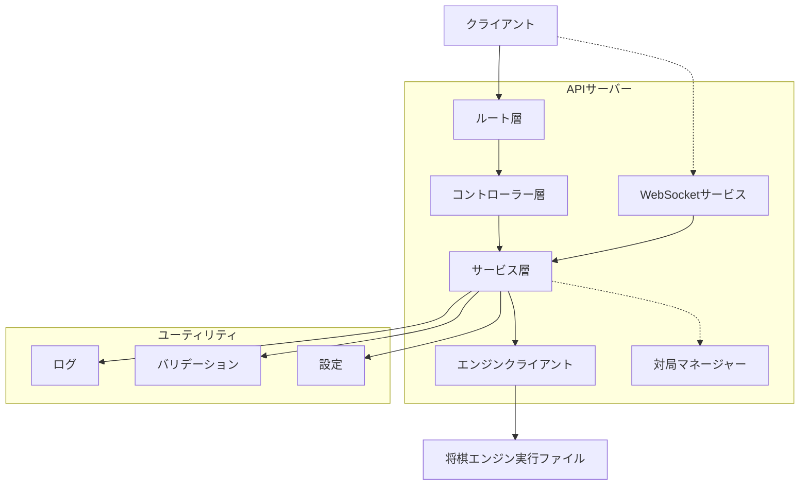
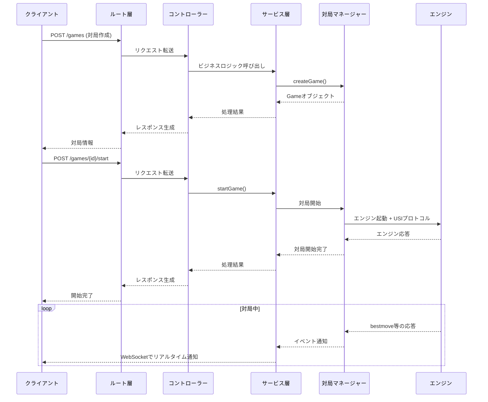

# 将棋エンジンAPIサーバー仕様書

## 概要

Hono + WebSocket + TypeScriptで実装された将棋エンジン対局管理APIサーバーです。USIプロトコル対応の将棋エンジンと通信し、複数の対局を同時に管理します。階層化アーキテクチャを採用し、保守性と拡張性を確保しています。

## アーキテクチャ



## シーケンス図



## REST API

### 共通レスポンス形式

**成功レスポンス**：
```json
{
  "status": "success",
  "data": {...},
  "timestamp": "2025-01-01T00:00:00.000Z"
}
```

**エラーレスポンス**：
```json
{
  "error": "エラーメッセージ",
  "timestamp": "2025-01-01T00:00:00.000Z"
}
```

**バリデーションエラー**：
```json
{
  "error": "Player name is required",
  "timestamp": "2025-01-01T00:00:00.000Z"
}
```

### エンドポイント

#### 1. ヘルスチェック
```
GET /health
```

レスポンス：
```json
{
  "status": "ok",
  "timestamp": "2025-01-01T00:00:00.000Z"
}
```

#### 2. 対局一覧取得
```
GET /games
```

レスポンス：
```json
{
  "games": [
    {
      "id": "uuid-string",
      "player": "プレイヤー名",
      "enginePath": "エンジンパス",
      "state": "waiting|playing|ended",
      "position": "startpos",
      "timeLimit": 60000,
      "byoyomi": 10000,
      "createdAt": "2025-01-01T00:00:00.000Z",
      "updatedAt": "2025-01-01T00:00:00.000Z"
    }
  ]
}
```

#### 3. 対局情報取得
```
GET /games/{gameId}
```

レスポンス：
```json
{
  "game": {
    "id": "uuid-string",
    // Gameオブジェクト
  }
}
```

#### 4. 新規対局作成
```
POST /games
Content-Type: application/json
```

**リクエストボディ**：
```json
{
  "player": "プレイヤー名（必須、最大100文字）",
  "enginePath": "エンジンパス（任意）",
  "position": "局面（任意、デフォルト: startpos）",
  "timeLimit": 60000,          // 持ち時間（ms、1-3,600,000）
  "byoyomi": 10000             // 秒読み（ms、1-60,000）
}
```

レスポンス（201）：
```json
{
  "game": {
    "id": "uuid-string",
    // 作成されたGameオブジェクト
  }
}
```

#### 5. 対局開始
```
POST /games/{gameId}/start
```

**レスポンス**：
```json
{
  "status": "success",
  "data": { "message": "Game started successfully" },
  "timestamp": "2025-01-01T00:00:00.000Z"
}
```

#### 6. 対局停止
```
POST /games/{gameId}/stop
```

**レスポンス**：
```json
{
  "status": "success",
  "data": { "message": "Game stopped successfully" },
  "timestamp": "2025-01-01T00:00:00.000Z"
}
```

#### 7. 対局終了
```
DELETE /games/{gameId}
```

**レスポンス**：
```json
{
  "status": "success",
  "data": { "message": "Game ended successfully" },
  "timestamp": "2025-01-01T00:00:00.000Z"
}
```

## WebSocket API

**⚠️ 現在、WebSocket機能は一時的に無効化されています。**

将来的には以下の機能を提供予定：

### 接続エンドポイント（予定）
```
ws://localhost:3000/ws
```

### 予定されるメッセージ形式

```typescript
interface WebSocketMessage {
  type: 'engine_response' | 'game_state' | 'error' | 'game_created' |
        'game_started' | 'game_stopped' | 'game_ended';
  gameId: string;
  data: any;
  timestamp: Date;
}
```

### 予定される機能
- リアルタイムの対局状況通知
- エンジン応答のストリーミング
- 対局作成リクエスト（WebSocket経由）

**現在の代替手段**: REST APIで対局操作と状態確認が可能です。

## データモデル

### Game
```typescript
interface Game {
  id: string;           // UUID
  player: string;       // プレイヤー名
  enginePath: string;   // エンジンパス
  state: GameState;     // waiting | playing | ended
  position: string;     // 局面（USI形式）
  timeLimit: number;    // 持ち時間（ms）
  byoyomi: number;      // 秒読み（ms）
  createdAt: Date;      // 作成日時
  updatedAt: Date;      // 更新日時
}
```

### EngineResponse
```typescript
interface EngineResponse {
  gameId: string;
  command: string;      // エンジンコマンド
  response: string;     // エンジン応答
  timestamp: Date;
}
```

## 使用例

### curlでのAPI使用

```bash
# 対局作成
curl -X POST http://localhost:3000/games \
  -H "Content-Type: application/json" \
  -d '{
    "player": "TestPlayer",
    "timeLimit": 30000,
    "byoyomi": 5000
  }'

# 対局開始
curl -X POST http://localhost:3000/games/{gameId}/start

# 対局一覧
curl http://localhost:3000/games
```

### REST APIクライアント例

```javascript
// 対局作成
async function createGame() {
  const response = await fetch('http://localhost:3000/games', {
    method: 'POST',
    headers: {
      'Content-Type': 'application/json'
    },
    body: JSON.stringify({
      player: 'RESTPlayer',
      timeLimit: 60000,
      byoyomi: 10000
    })
  });

  const result = await response.json();
  console.log('Game created:', result.game);
  return result.game;
}

// 対局開始
async function startGame(gameId) {
  const response = await fetch(`http://localhost:3000/games/${gameId}/start`, {
    method: 'POST'
  });

  const result = await response.json();
  console.log('Game started:', result);
}

// 対局一覧取得
async function getGames() {
  const response = await fetch('http://localhost:3000/games');
  const result = await response.json();
  console.log('Games:', result.games);
  return result.games;
}

// 使用例
(async () => {
  // 対局作成
  const game = await createGame();

  // 対局開始
  await startGame(game.id);

  // 対局一覧確認
  await getGames();
})();
```

## 環境設定

### 環境変数
```bash
PORT=3000                          # サーバーポート
NODE_ENV=development               # 環境設定（development/production）
DEFAULT_ENGINE_PATH=../source/minishogi-by-gcc  # デフォルトエンジンパス
DEFAULT_TIME_LIMIT=60000           # デフォルト持ち時間（ms）
DEFAULT_BYOYOMI=10000              # デフォルト秒読み（ms）
LOG_LEVEL=info                     # ログレベル（info/warn/error/debug）
```

### 起動方法
```bash
# 開発モードでサーバー起動
pnpm server

# CLIクライアント実行
pnpm dev [engine_path]

# ビルドして実行
pnpm build
node dist/server.js
```

### ログ出力
サーバーは構造化ログを出力します：
```
[2025-01-01T00:00:00.000Z] INFO: Starting server on port 3000
[2025-01-01T00:00:00.000Z] INFO: WebSocket connection established { connectionId: "uuid" }
[2025-01-01T00:00:00.000Z] ERROR: Failed to start game { gameId: "uuid", error: "Engine not found" }
```

## エラーハンドリング

### HTTPステータスコード
- 200: 成功
- 201: 作成成功
- 400: リクエストエラー
- 404: リソース未検出
- 500: サーバーエラー

### 主なエラー例
- `Game not found` - 指定された対局IDが存在しない
- `Player name is required` - プレイヤー名が未入力
- `Failed to start game` - 対局開始失敗（既に開始済み、エンジン未検出等）
- `Invalid request format` - JSON形式の不正
- `Internal server error` - サーバー内部エラー

### WebSocketエラー
- `Invalid message format` - メッセージ形式不正
- `Failed to create game` - 対局作成失敗
- `Engine not found` - エンジンが見つからない

## 関連ドキュメント

- [プロジェクト構成](./project-structure.md) - アーキテクチャ詳細
- [USIプロトコル仕様](http://shogidojo.net/usi/) - 将棋エンジン通信プロトコル

## セキュリティ考慮事項

- **現在の状態**: 認証・認可機構なし、ローカル環境での使用を想定
- **推奨事項**:
  - 本番環境ではJWTやOAuthによる認証機能の実装
  - HTTPSでの通信
  - レートリミットの設定
  - CORSの適切な設定
  - 入力値の検証とサニタイズ

## 制限事項

- **WebSocket**: 現在無効化（将来的に実装予定）
- 同時対局数はサーバーリソースに依存
- エンジンプロセスのライフタイムは対局と連動
- 対局データはインメモリ保持（永続化なし）
- リアルタイム通知なし（定期的なポーリングが必要）

## 開発ロードマップ

### 現在利用可能
- ✅ REST APIすべてのエンドポイント
- ✅ 対局の作成・開始・停止・終了
- ✅ エンジンとのUSIプロトコル通信
- ✅ 構造化ログ出力
- ✅ TypeScript型安全性

### 将来的な実装
- 🔄 WebSocketによるリアルタイム通信
- 📝 対局データの永続化
- 🔐 認証・認可機能
- 📊 対局記録と統計
- 🎨 Webフロントエンド