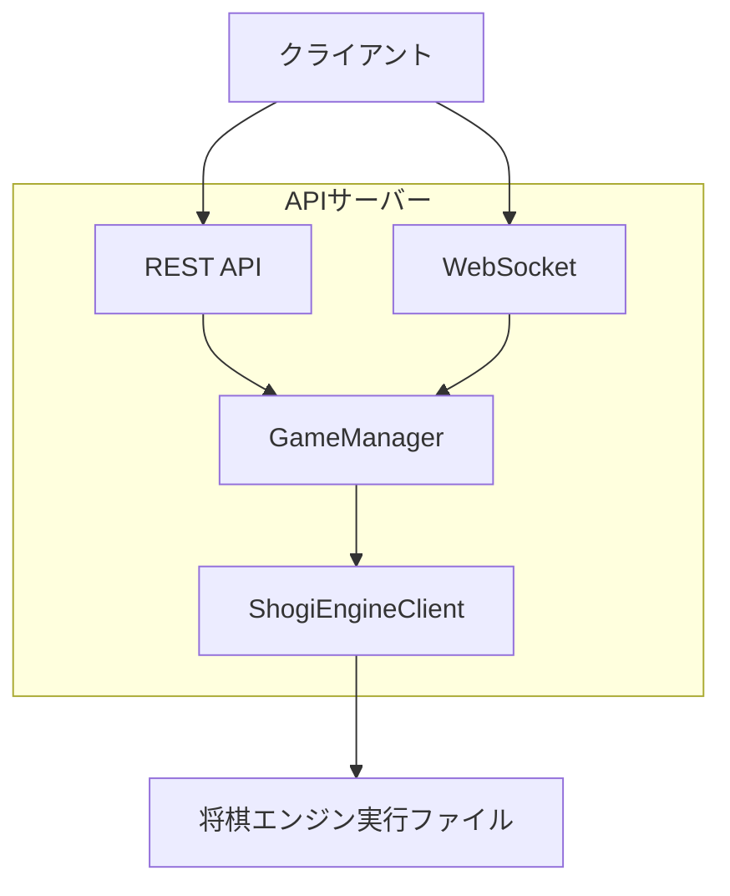
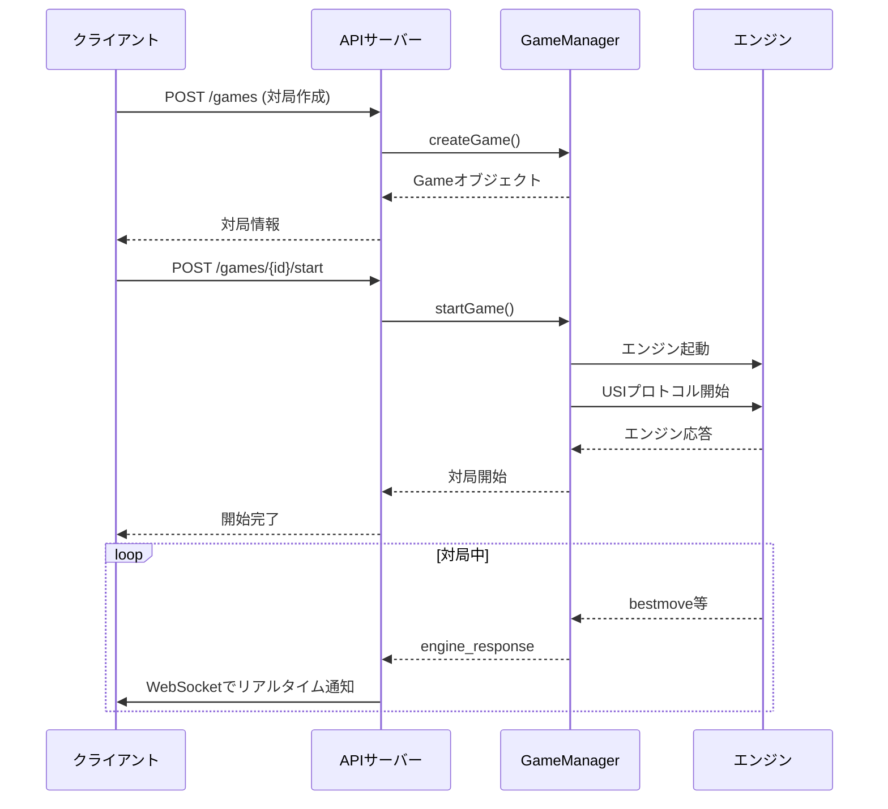

# 将棋エンジンAPIサーバー仕様書

## 概要

Hono + WebSocketで実装された将棋エンジン対局管理APIサーバーです。USIプロトコル対応の将棋エンジンと通信し、複数の対局を同時に管理します。

## アーキテクチャ



## シーケンス図



## REST API

### 共通レスポンス形式

成功レスポンス：
```json
{
  "status": "success",
  "data": {...},
  "timestamp": "2025-01-01T00:00:00.000Z"
}
```

エラーレスポンス：
```json
{
  "error": "エラーメッセージ",
  "timestamp": "2025-01-01T00:00:00.000Z"
}
```

### エンドポイント

#### 1. ヘルスチェック
```
GET /health
```

レスポンス：
```json
{
  "status": "ok",
  "timestamp": "2025-01-01T00:00:00.000Z"
}
```

#### 2. 対局一覧取得
```
GET /games
```

レスポンス：
```json
{
  "games": [
    {
      "id": "uuid-string",
      "player": "プレイヤー名",
      "enginePath": "エンジンパス",
      "state": "waiting|playing|ended",
      "position": "startpos",
      "timeLimit": 60000,
      "byoyomi": 10000,
      "createdAt": "2025-01-01T00:00:00.000Z",
      "updatedAt": "2025-01-01T00:00:00.000Z"
    }
  ]
}
```

#### 3. 対局情報取得
```
GET /games/{gameId}
```

レスポンス：
```json
{
  "game": {
    "id": "uuid-string",
    // Gameオブジェクト
  }
}
```

#### 4. 新規対局作成
```
POST /games
Content-Type: application/json
```

リクエストボディ：
```json
{
  "player": "プレイヤー名（必須）",
  "enginePath": "エンジンパス（任意）",
  "position": "局面（任意、デフォルト: startpos）",
  "timeLimit": 60000,
  "byoyomi": 10000
}
```

レスポンス（201）：
```json
{
  "game": {
    "id": "uuid-string",
    // 作成されたGameオブジェクト
  }
}
```

#### 5. 対局開始
```
POST /games/{gameId}/start
```

レスポンス：
```json
{
  "message": "Game started"
}
```

#### 6. 対局停止
```
POST /games/{gameId}/stop
```

レスポンス：
```json
{
  "message": "Game stopped"
}
```

#### 7. 対局終了
```
DELETE /games/{gameId}
```

レスポンス：
```json
{
  "message": "Game ended"
}
```

## WebSocket API

### 接続エンドポイント
```
ws://localhost:3000/ws
```

### メッセージ形式

```typescript
interface WebSocketMessage {
  type: 'engine_response' | 'game_state' | 'error' | 'game_created';
  gameId: string;
  data: any;
  timestamp: Date;
}
```

### 受信メッセージ

#### 対局作成リクエスト
```json
{
  "type": "create_game",
  "data": {
    "player": "プレイヤー名",
    "enginePath": "エンジンパス",
    "position": "startpos",
    "timeLimit": 60000,
    "byoyomi": 10000
  }
}
```

### 送信メッセージ

#### 対局作成完了
```json
{
  "type": "game_created",
  "gameId": "uuid-string",
  "data": {
    // Gameオブジェクト
  },
  "timestamp": "2025-01-01T00:00:00.000Z"
}
```

#### エンジン応答
```json
{
  "type": "engine_response",
  "gameId": "uuid-string",
  "data": {
    "gameId": "uuid-string",
    "command": "bestmove 7g7f",
    "response": "bestmove 7g7f",
    "timestamp": "2025-01-01T00:00:00.000Z"
  },
  "timestamp": "2025-01-01T00:00:00.000Z"
}
```

#### 対局状態変化
```json
{
  "type": "game_state",
  "gameId": "uuid-string",
  "data": {
    "state": "started|stopped|ended",
    "game": {}
  },
  "timestamp": "2025-01-01T00:00:00.000Z"
}
```

#### エラー通知
```json
{
  "type": "error",
  "gameId": "uuid-string",
  "data": {
    "error": "エラーメッセージ"
  },
  "timestamp": "2025-01-01T00:00:00.000Z"
}
```

## データモデル

### Game
```typescript
interface Game {
  id: string;           // UUID
  player: string;       // プレイヤー名
  enginePath: string;   // エンジンパス
  state: GameState;     // waiting | playing | ended
  position: string;     // 局面（USI形式）
  timeLimit: number;    // 持ち時間（ms）
  byoyomi: number;      // 秒読み（ms）
  createdAt: Date;      // 作成日時
  updatedAt: Date;      // 更新日時
}
```

### EngineResponse
```typescript
interface EngineResponse {
  gameId: string;
  command: string;      // エンジンコマンド
  response: string;     // エンジン応答
  timestamp: Date;
}
```

## 使用例

### curlでのAPI使用

```bash
# 対局作成
curl -X POST http://localhost:3000/games \
  -H "Content-Type: application/json" \
  -d '{
    "player": "TestPlayer",
    "timeLimit": 30000,
    "byoyomi": 5000
  }'

# 対局開始
curl -X POST http://localhost:3000/games/{gameId}/start

# 対局一覧
curl http://localhost:3000/games
```

### WebSocketクライアント例

```javascript
const ws = new WebSocket('ws://localhost:3000/ws');

ws.onopen = () => {
  console.log('Connected to WebSocket');
};

ws.onmessage = (event) => {
  const message = JSON.parse(event.data);
  console.log('Received:', message);
};

// 対局作成
ws.send(JSON.stringify({
  type: 'create_game',
  data: {
    player: 'WebSocketPlayer',
    timeLimit: 60000
  }
}));
```

## 環境設定

### 環境変数
- `PORT`: サーバーポート（デフォルト: 3000）

### 起動方法
```bash
# 開発モード
pnpm server

# ビルドして実行
pnpm build
node dist/server.js
```

## エラーハンドリング

### HTTPステータスコード
- 200: 成功
- 201: 作成成功
- 400: リクエストエラー
- 404: リソース未検出
- 500: サーバーエラー

### 主なエラー
- 対局が見つからない
- 既に対局が開始されている
- エンジン起動失敗
- 不正なリクエスト形式

## セキュリティ考慮事項

- 現在は認証・認可機構なし
- ローカル環境での使用を想定
- 本番環境では認証機能の実装を推奨