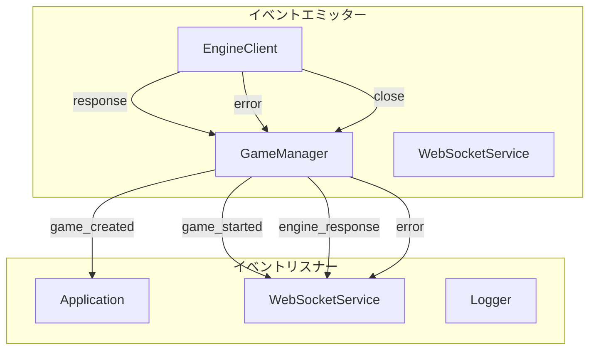
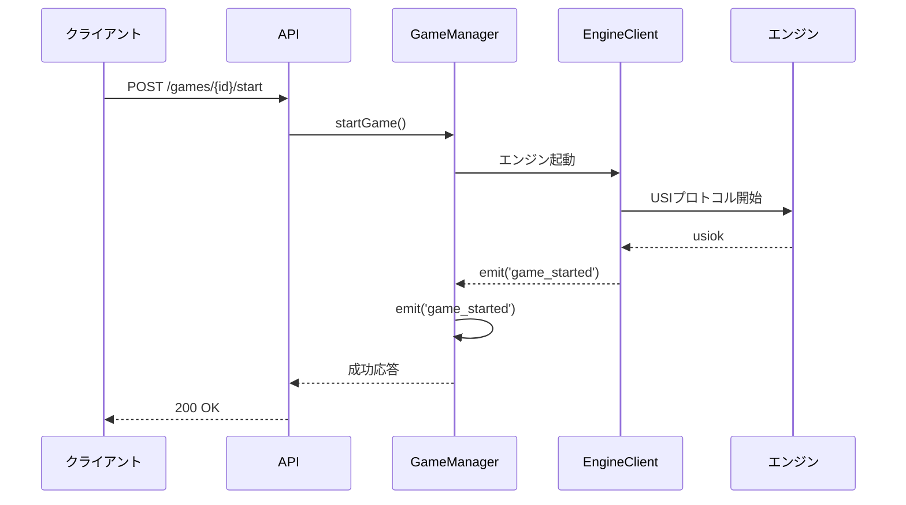
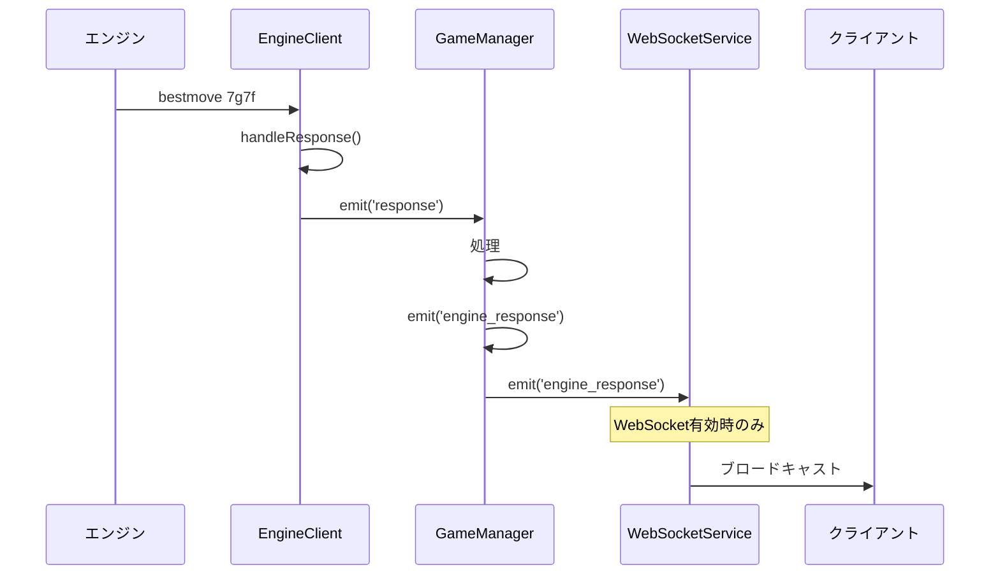

# イベントシステム仕様

## 概要

将棋エンジンAPIサーバーはイベント駆動型アーキテクチャを採用しており、対局の状態変化やエンジン応答をリアルタイムに通知します。現在はWebSocketが無効化されているため、主に内部コンポーネント間の連携に使用されています。

## イベントシステムのアーキテクチャ



## イベント一覧

### 1. 対局関連イベント

#### `game_created`
対局が新規作成されたときに発火

**エミッター**: `GameManager`

**データ**:
```typescript
interface Game {
  id: string;
  player: string;
  enginePath: string;
  state: 'waiting';
  position: string;
  timeLimit: number;
  byoyomi: number;
  createdAt: Date;
  updatedAt: Date;
}
```

**使用例**:
```typescript
gameManager.on('game_created', (game: Game) => {
  logInfo('New game created', { gameId: game.id, player: game.player });
});
```

#### `game_started`
対局が開始されたときに発火

**エミッター**: `GameManager`

**データ**:
```typescript
interface Game {
  id: string;
  // ... Gameの全プロパティ
  state: 'playing';
}
```

**使用例**:
```typescript
gameManager.on('game_started', (game: Game) => {
  logInfo('Game started', { gameId: game.id });
  // ここで対局開始の処理（例: 監視開始、統計記録等）
});
```

#### `game_stopped`
対局が停止されたときに発火

**エミッター**: `GameManager`

**データ**:
```typescript
interface Game {
  id: string;
  // ... Gameの全プロパティ
  state: 'playing'; // まだendedではない
}
```

#### `game_ended`
対局が完全に終了したときに発火

**エミッター**: `GameManager`

**データ**:
```typescript
interface Game {
  id: string;
  // ... Gameの全プロパティ
  state: 'ended';
}
```

### 2. エンジン関連イベント

#### `engine_response`
将棋エンジンからの応答を受信したときに発火

**エミッター**: `GameManager`

**データ**:
```typescript
interface EngineResponse {
  gameId: string;
  command: string;
  response: string;
  timestamp: Date;
}
```

**使用例**:
```typescript
gameManager.on('engine_response', (response: EngineResponse) => {
  logInfo('Engine response received', {
    gameId: response.gameId,
    response: response.response
  });

  // 最善手の応答を処理
  if (response.response.startsWith('bestmove')) {
    handleBestMove(response.gameId, response.response);
  }
});
```

#### `error`
エラーが発生したときに発火

**エミッター**: `GameManager`, `EngineClient`

**データ**:
```typescript
interface ErrorEvent {
  gameId: string;
  error: string;
  details?: any;
}
```

**使用例**:
```typescript
gameManager.on('error', (error: ErrorEvent) => {
  logError('Game error', {
    gameId: error.gameId,
    error: error.error,
    details: error.details
  });

  // エラーハンドリング
  handleGameError(error.gameId, error.error);
});
```

### 3. エンジンクライアントイベント

#### `response`
エンジンからの生応答を受信

**エミッター**: `ShogiEngineClient`

**データ**:
```typescript
string // エンジンからの生レスポンス
```

#### `close`
エンジンプロセスが終了

**エミッター**: `ShogiEngineClient`

**データ**:
```typescript
number // プロセス終了コード
```

## イベントリスナーの設定例

### 基本的なリスナー設定

```typescript
import { GameManager } from './services/gameManager.js';
import { logInfo, logError } from './utils/logger.js';

const gameManager = new GameManager();

// 対局作成イベント
gameManager.on('game_created', (game) => {
  logInfo('Game created', { gameId: game.id, player: game.player });
});

// 対局開始イベント
gameManager.on('game_started', (game) => {
  logInfo('Game started', { gameId: game.id });
  // 対局監視や統計記録などの処理
});

// エンジン応答イベント
gameManager.on('engine_response', (response) => {
  logInfo('Engine response', {
    gameId: response.gameId,
    response: response.response
  });

  // USIコマンドに応じた処理
  if (response.response.startsWith('bestmove')) {
    // 最善手の処理
  } else if (response.response.startsWith('info')) {
    // 情報メッセージの処理
  }
});

// エラーイベント
gameManager.on('error', (error) => {
  logError('Game error', {
    gameId: error.gameId,
    error: error.error
  });
});

// 対局終了イベント
gameManager.on('game_ended', (game) => {
  logInfo('Game ended', { gameId: game.id });
  // 後処理（リソース解放等）
});
```

### 高度なイベント処理

```typescript
class GameEventHandler {
  private activeGames: Map<string, any> = new Map();
  private gameStats: Map<string, any> = new Map();

  constructor(private gameManager: GameManager) {
    this.setupEventListeners();
  }

  private setupEventListeners() {
    // 対局開始時の処理
    this.gameManager.on('game_started', (game) => {
      this.activeGames.set(game.id, {
        startedAt: new Date(),
        moveCount: 0,
        ...game
      });

      this.gameStats.set(game.id, {
        totalResponseTime: 0,
        responseCount: 0
      });
    });

    // エンジン応答時の処理
    this.gameManager.on('engine_response', (response) => {
      const stats = this.gameStats.get(response.gameId);
      if (stats) {
        stats.totalResponseTime += Date.now() - response.timestamp.getTime();
        stats.responseCount++;

        // 応答時間が長すぎる場合の警告
        const avgTime = stats.totalResponseTime / stats.responseCount;
        if (avgTime > 5000) {
          logWarn('Slow engine response', {
            gameId: response.gameId,
            avgTime: avgTime
          });
        }
      }
    });

    // 対局終了時の統計記録
    this.gameManager.on('game_ended', (game) => {
      const gameData = this.activeGames.get(game.id);
      const stats = this.gameStats.get(game.id);

      if (gameData && stats) {
        const duration = Date.now() - gameData.startedAt.getTime();
        const avgResponseTime = stats.responseCount > 0
          ? stats.totalResponseTime / stats.responseCount
          : 0;

        logInfo('Game statistics', {
          gameId: game.id,
          duration: duration,
          totalMoves: gameData.moveCount,
          avgResponseTime: avgResponseTime,
          totalResponses: stats.responseCount
        });
      }

      // クリーンアップ
      this.activeGames.delete(game.id);
      this.gameStats.delete(game.id);
    });
  }
}
```

## イベントの伝播フロー

### 対局開始のイベントフロー



### エンジン応答のイベントフロー



## WebSocket連携（将来的実装）

WebSocketが有効化された場合、以下のイベントがクライアントにブロードキャストされます：

```typescript
interface WebSocketMessage {
  type: 'game_created' | 'game_started' | 'game_stopped' |
        'game_ended' | 'engine_response' | 'error';
  gameId: string;
  data: any;
  timestamp: Date;
}
```

### クライアント側の実装例

```javascript
// WebSocketクライアントでのイベント処理
const ws = new WebSocket('ws://localhost:3000/ws');

ws.onmessage = (event) => {
  const message = JSON.parse(event.data);

  switch (message.type) {
    case 'game_created':
      console.log('New game:', message.data);
      break;

    case 'game_started':
      console.log('Game started:', message.gameId);
      updateGameStatus(message.gameId, 'playing');
      break;

    case 'engine_response':
      console.log('Engine move:', message.data.response);
      if (message.data.response.startsWith('bestmove')) {
        updateBoard(message.gameId, message.data.response);
      }
      break;

    case 'error':
      console.error('Game error:', message.data.error);
      showError(message.gameId, message.data.error);
      break;
  }
};
```

## ベストプラクティス

### 1. イベントリスナーの管理
- 不要になったリスナーは必ず `off()` で削除
- メモリリークを防ぐため、エラーハンドリングを徹底

```typescript
// 良い例
const handleGameStarted = (game) => { /* ... */ };
gameManager.on('game_started', handleGameStarted);

// 不要になったら削除
gameManager.off('game_started', handleGameStarted);
```

### 2. エラーハンドリング
- すべてのイベントリスナーでエラーハンドリングを実装
- ログ記録を徹底

```typescript
gameManager.on('engine_response', (response) => {
  try {
    // 処理
  } catch (error) {
    logError('Event handler error', {
      gameId: response.gameId,
      error: error.message
    });
  }
});
```

### 3. パフォーマンス考慮
- 重い処理は非同期で実行
- 頻繁なイベントは処理を最適化

```typescript
gameManager.on('engine_response', async (response) => {
  // 重い処理を非同期で実行
  setImmediate(() => {
    processEngineResponse(response);
  });
});
```

## 現在の制限事項

- WebSocketが無効化されているため、クライアントへのリアルタイム通知は不可
- イベント履歴は保持されない
- イベントのフィルタリング機能なし
- 複数のリスナー間でのイベント順序保証なし