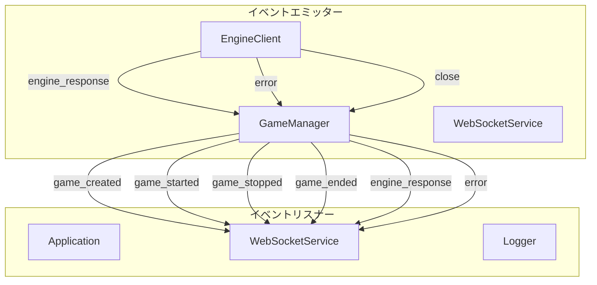
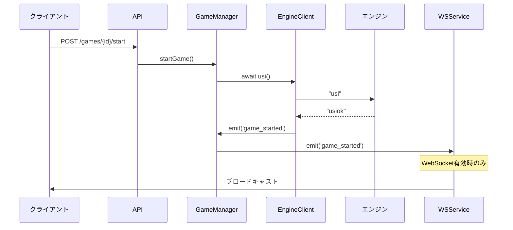
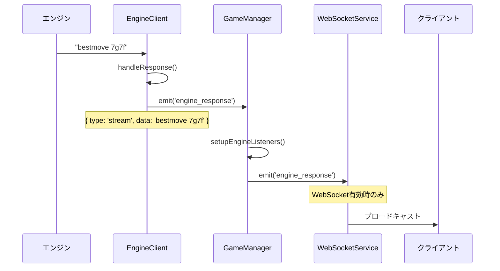

# イベントシステム仕様

## 概要

将棋エンジンAPIサーバーはイベント駆動型アーキテクチャを採用しており、対局の状態変化やエンジン応答をリアルタイムに通知します。現在はWebSocketが無効化されているため、主に内部コンポーネント間の連携に使用されています。

## イベントシステムのアーキテクチャ



## イベント一覧

### 1. 対局関連イベント

#### `game_created`
対局が新規作成されたときに発火

**エミッター**: `GameManager`

**リスナー**: `WebSocketService`

**データ**:
```typescript
interface Game {
  id: string;
  player: string;
  enginePath: string;
  state: 'waiting';
  position: string;
  timeLimit: number;
  byoyomi: number;
  createdAt: Date;
  updatedAt: Date;
}
```

**実装例**:
```typescript
// src/services/gameManager.ts:39
this.emit('game_created', game);

// src/services/websocketService.ts:189
this.gameManager.on('game_created', (game) => {
  const message: WebSocketMessage = {
    type: 'game_created',
    gameId: game.id,
    data: game,
    timestamp: new Date()
  };
  this.broadcastToGame(game.id, message);
});
```

#### `game_started`
対局が開始されたときに発火

**エミッター**: `GameManager`

**リスナー**: `WebSocketService`

**データ**:
```typescript
interface Game {
  id: string;
  // ... Gameの全プロパティ
  state: 'playing';
}
```

**実装例**:
```typescript
// src/services/gameManager.ts:91
this.emit('game_started', game);

// src/services/websocketService.ts:199
this.gameManager.on('game_started', (game) => {
  const message: WebSocketMessage = {
    type: 'game_started',
    gameId: game.id,
    data: { state: 'started', game },
    timestamp: new Date()
  };
  this.broadcastToGame(game.id, message);
});
```

#### `game_stopped`
対局が停止されたときに発火

**エミッター**: `GameManager`

**リスナー**: `WebSocketService`

**データ**:
```typescript
interface Game {
  id: string;
  // ... Gameの全プロパティ
  state: 'ended';
}
```

**実装例**:
```typescript
// src/services/gameManager.ts:124
this.emit('game_stopped', game);

// src/services/websocketService.ts:209
this.gameManager.on('game_stopped', (game) => {
  const message: WebSocketMessage = {
    type: 'game_stopped',
    gameId: game.id,
    data: { state: 'stopped', game },
    timestamp: new Date()
  };
  this.broadcastToGame(game.id, message);
});
```

#### `game_ended`
対局が完全に終了したときに発火

**エミッター**: `GameManager`

**リスナー**: `WebSocketService`

**データ**:
```typescript
interface Game {
  id: string;
  // ... Gameの全プロパティ
  state: 'ended';
}
```

**実装例**:
```typescript
// src/services/gameManager.ts:151, 162
this.emit('game_ended', game);

// src/services/websocketService.ts:219
this.gameManager.on('game_ended', (game) => {
  const message: WebSocketMessage = {
    type: 'game_ended',
    gameId: game.id,
    data: { state: 'ended', game },
    timestamp: new Date()
  };
  this.broadcastToGame(game.id, message);
});
```

### 2. エンジン関連イベント

#### `engine_response`
将棋エンジンからのストリーミング応答を受信したときに発火

**エミッター**: `ShogiEngineClient`, `GameManager`

**リスナー**: `GameManager`, `WebSocketService`

**データ**:
```typescript
// ShogiEngineClientから
interface EngineStreamEvent {
  type: 'stream';
  data: string;  // 'info ...' または 'bestmove ...'
}

// GameManagerから
interface EngineResponse {
  gameId: string;
  command: string;
  response: string;
  timestamp: Date;
}
```

**実装例**:
```typescript
// src/services/shogiEngineClient.ts:101
this.emit('engine_response', { type: 'stream', data: trimmedLine });

// src/services/gameManager.ts:181
this.emit('engine_response', engineResponse);

// src/services/websocketService.ts:229
this.gameManager.on('engine_response', (response) => {
  const message: WebSocketMessage = {
    type: 'engine_response',
    gameId: response.gameId,
    data: response,
    timestamp: new Date()
  };
  this.broadcastToGame(response.gameId, message);
});
```

#### `error`
エラーが発生したときに発火

**エミッター**: `GameManager`, `ShogiEngineClient`

**リスナー**: `WebSocketService`

**データ**:
```typescript
interface ErrorEvent {
  gameId: string;
  error: string;
  details?: any;
}
```

**実装例**:
```typescript
// src/services/gameManager.ts:88, 97, 194
this.emit('error', { gameId, error: error.message });

// src/services/websocketService.ts:239
this.gameManager.on('error', (error) => {
  const errorMessage: WebSocketMessage = {
    type: 'error',
    gameId: error.gameId,
    data: { error: error.error },
    timestamp: new Date()
  };
  this.broadcastToGame(error.gameId, errorMessage);
});
```

### 3. エンジンクライアントイベント

#### `engine_response` (stream)
エンジンからのストリーミング応答を受信

**エミッター**: `ShogiEngineClient`

**リスナー**: `ShogiEngineClient.go()`, 外部クライアント

**データ**:
```typescript
interface EngineStreamEvent {
  type: 'stream';
  data: string;  // 'info ...' または 'bestmove ...'
}
```

**実装例**:
```typescript
// src/services/shogiEngineClient.ts:101
if (trimmedLine.startsWith('info') || trimmedLine.startsWith('bestmove')) {
  this.emit('engine_response', { type: 'stream', data: trimmedLine });
}

// src/services/shogiEngineClient.ts:276-277 (goメソッド内)
this.on('engine_response', infoListener);
this.on('engine_response', bestmoveListener);

// テストコード
client.on('engine_response', (event: { type: string; data: string }) => {
  console.log(`[ENGINE RESPONSE] ${event.type}: ${event.data}`);
});
```

#### `close`
エンジンプロセスが終了

**エミッター**: `ShogiEngineClient`

**データ**:
```typescript
number // プロセス終了コード
```

**実装例**:
```typescript
// src/services/shogiEngineClient.ts:72
this.emit('close', code);

// テストコード
client.on('close', (code: number) => {
  console.log(`[ENGINE CLOSED] Process exited with code ${code}`);
});
```

#### `error`
エンジンプロセスでエラーが発生

**エミッター**: `ShogiEngineClient`

**データ**:
```typescript
Error // エラーオブジェクト
```

**実装例**:
```typescript
// src/services/shogiEngineClient.ts:78
this.emit('error', error);

// テストコード
client.on('error', (error: Error) => {
  console.error(`[ENGINE ERROR] ${error.message}`);
});
```

## イベントの伝播フロー

### 対局開始のイベントフロー



### エンジン応答のイベントフロー



## イベントリスナーの設定例

### 基本的なリスナー設定

```typescript
import { GameManager } from './services/gameManager.js';
import { logInfo, logError } from './utils/logger.js';

const gameManager = new GameManager();

// 対局作成イベント
gameManager.on('game_created', (game) => {
  logInfo('Game created', { gameId: game.id, player: game.player });
});

// 対局開始イベント
gameManager.on('game_started', (game) => {
  logInfo('Game started', { gameId: game.id });
  // 対局監視や統計記録などの処理
});

// エンジン応答イベント
gameManager.on('engine_response', (response) => {
  logInfo('Engine response', {
    gameId: response.gameId,
    response: response.response
  });

  // USIコマンドに応じた処理
  if (response.response.startsWith('bestmove')) {
    // 最善手の処理
  } else if (response.response.startsWith('info')) {
    // 情報メッセージの処理
  }
});

// エラーイベント
gameManager.on('error', (error) => {
  logError('Game error', {
    gameId: error.gameId,
    error: error.error
  });
});

// 対局終了イベント
gameManager.on('game_ended', (game) => {
  logInfo('Game ended', { gameId: game.id });
  // 後処理（リソース解放等）
});
```

### 高度なイベント処理

```typescript
class GameEventHandler {
  private activeGames: Map<string, any> = new Map();
  private gameStats: Map<string, any> = new Map();

  constructor(private gameManager: GameManager) {
    this.setupEventListeners();
  }

  private setupEventListeners() {
    // 対局開始時の処理
    this.gameManager.on('game_started', (game) => {
      this.activeGames.set(game.id, {
        startedAt: new Date(),
        moveCount: 0,
        ...game
      });

      this.gameStats.set(game.id, {
        totalResponseTime: 0,
        responseCount: 0
      });
    });

    // エンジン応答時の処理
    this.gameManager.on('engine_response', (response) => {
      const stats = this.gameStats.get(response.gameId);
      if (stats) {
        stats.totalResponseTime += Date.now() - response.timestamp.getTime();
        stats.responseCount++;

        // 応答時間が長すぎる場合の警告
        const avgTime = stats.totalResponseTime / stats.responseCount;
        if (avgTime > 5000) {
          logWarn('Slow engine response', {
            gameId: response.gameId,
            avgTime: avgTime
          });
        }
      }
    });

    // 対局終了時の統計記録
    this.gameManager.on('game_ended', (game) => {
      const gameData = this.activeGames.get(game.id);
      const stats = this.gameStats.get(game.id);

      if (gameData && stats) {
        const duration = Date.now() - gameData.startedAt.getTime();
        const avgResponseTime = stats.responseCount > 0
          ? stats.totalResponseTime / stats.responseCount
          : 0;

        logInfo('Game statistics', {
          gameId: game.id,
          duration: duration,
          totalMoves: gameData.moveCount,
          avgResponseTime: avgResponseTime,
          totalResponses: stats.responseCount
        });
      }

      // クリーンアップ
      this.activeGames.delete(game.id);
      this.gameStats.delete(game.id);
    });
  }
}
```

## イベントの伝播フロー

### 対局開始のイベントフロー


### エンジン応答のイベントフロー


## WebSocket連携（将来的実装）

WebSocketが有効化された場合、以下のイベントがクライアントにブロードキャストされます：

```typescript
interface WebSocketMessage {
  type: 'game_created' | 'game_started' | 'game_stopped' |
        'game_ended' | 'engine_response' | 'error';
  gameId: string;
  data: any;
  timestamp: Date;
}
```

### クライアント側の実装例

```javascript
// WebSocketクライアントでのイベント処理
const ws = new WebSocket('ws://localhost:3000/ws');

ws.onmessage = (event) => {
  const message = JSON.parse(event.data);

  switch (message.type) {
    case 'game_created':
      console.log('New game:', message.data);
      break;

    case 'game_started':
      console.log('Game started:', message.gameId);
      updateGameStatus(message.gameId, 'playing');
      break;

    case 'engine_response':
      console.log('Engine move:', message.data.response);
      if (message.data.response.startsWith('bestmove')) {
        updateBoard(message.gameId, message.data.response);
      }
      break;

    case 'error':
      console.error('Game error:', message.data.error);
      showError(message.gameId, message.data.error);
      break;
  }
};
```

## ベストプラクティス

### 1. イベントリスナーの管理
- 不要になったリスナーは必ず `off()` で削除
- メモリリークを防ぐため、エラーハンドリングを徹底

```typescript
// 良い例
const handleGameStarted = (game) => { /* ... */ };
gameManager.on('game_started', handleGameStarted);

// 不要になったら削除
gameManager.off('game_started', handleGameStarted);
```

### 2. エラーハンドリング
- すべてのイベントリスナーでエラーハンドリングを実装
- ログ記録を徹底

```typescript
gameManager.on('engine_response', (response) => {
  try {
    // 処理
  } catch (error) {
    logError('Event handler error', {
      gameId: response.gameId,
      error: error.message
    });
  }
});
```

### 3. パフォーマンス考慮
- 重い処理は非同期で実行
- 頻繁なイベントは処理を最適化

```typescript
gameManager.on('engine_response', async (response) => {
  // 重い処理を非同期で実行
  setImmediate(() => {
    processEngineResponse(response);
  });
});
```

## 現在の制限事項

- WebSocketが無効化されているため、クライアントへのリアルタイム通知は不可
- イベント履歴は保持されない
- イベントのフィルタリング機能なし
- 複数のリスナー間でのイベント順序保証なし