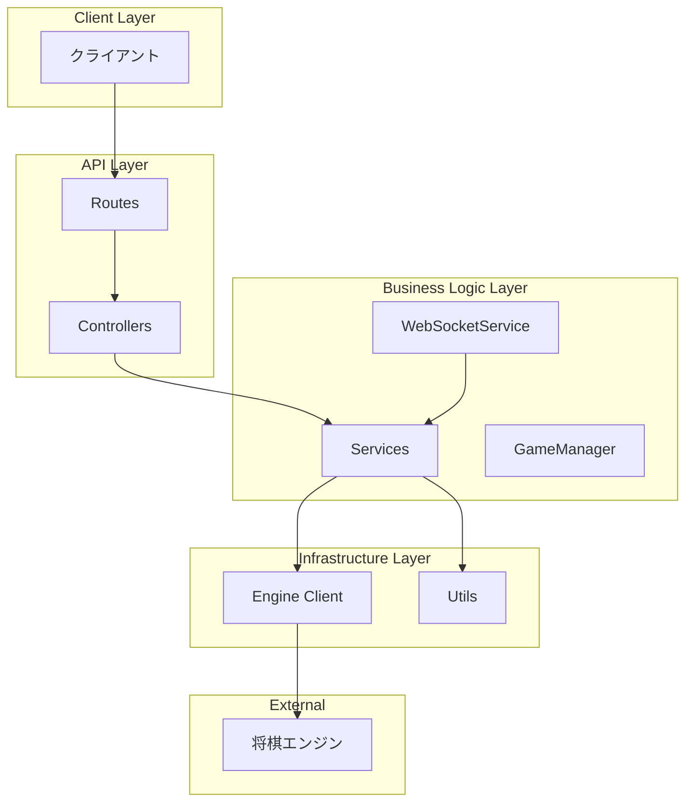
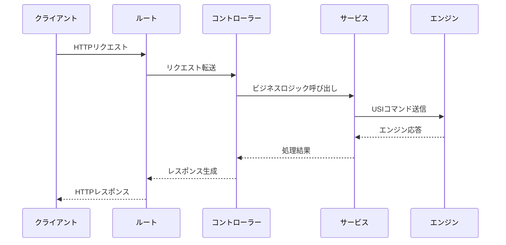
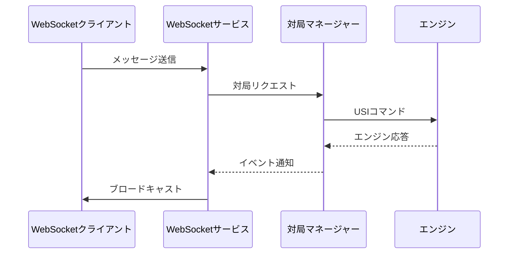

# プロジェクト構成

## 概要

将棋エンジンAPIサーバーは、階層化アーキテクチャで設計されており、各層が明確な責務を持つことで保守性と拡張性を確保しています。

## ディレクトリ構成

```
client/
├── docs/                  # ドキュメント
│   ├── api.md            # API仕様書
│   └── project-structure.md  # プロジェクト構成（このファイル）
├── src/                   # ソースコード
│   ├── types/            # 型定義層
│   │   ├── index.ts      # 型定義のエクスポート
│   │   ├── game.ts       # 対局関連の型
│   │   ├── api.ts        # API関連の型
│   │   └── websocket.ts  # WebSocket関連の型
│   ├── services/         # サービス層
│   │   ├── index.ts      # サービスのエクスポート
│   │   ├── shogiEngineClient.ts  # 将棋エンジン通信クライアント
│   │   ├── gameManager.ts        # 対局管理サービス
│   │   └── websocketService.ts   # WebSocket管理サービス
│   ├── controllers/      # コントローラー層
│   │   ├── index.ts      # コントローラーのエクスポート
│   │   ├── gameController.ts     # 対局APIコントローラー
│   │   └── healthController.ts   # ヘルスチェックコントローラー
│   ├── routes/           # ルート定義
│   │   ├── index.ts      # ルートのエクスポート
│   │   └── api.ts        # APIルート定義
│   ├── utils/            # ユーティリティ層
│   │   ├── index.ts      # ユーティリティのエクスポート
│   │   ├── logger.ts     # ログ出力ユーティリティ
│   │   ├── validation.ts # バリデーションユーティリティ
│   │   └── config.ts     # 設定管理ユーティリティ
│   ├── app.ts            # アプリケーション本体
│   ├── server.ts         # サーバーエントリーポイント
│   └── index.ts          # CLIクライアント
├── dist/                 # コンパイル済みコード
├── node_modules/         # 依存パッケージ
├── package.json          # パッケージ設定
├── tsconfig.json         # TypeScript設定
└── README.md             # プロジェクト説明
```

## アーキテクチャ図



## 各層の責務

### 1. 型定義層 (types/)

**責務**: アプリケーション全体で使用する型定義を管理

**主要ファイル**:
- `game.ts`: 対局、USIコマンド、エンジン応答などの型
- `api.ts`: APIリクエスト/レスポンスの型
- `websocket.ts`: WebSocketメッセージ、接続情報の型

### 2. サービス層 (services/)

**責務**: ビジネスロジックの実装と外部リソースとの連携

**主要ファイル**:
- `shogiEngineClient.ts`: USIプロトコルでのエンジン通信
- `gameManager.ts`: 対局のライフサイクル管理
- `websocketService.ts`: WebSocket接続とメッセージングの管理

### 3. コントローラー層 (controllers/)

**責務**: HTTPリクエストの処理とレスポンスの生成

**主要ファイル**:
- `gameController.ts`: 対局関連のAPIエンドポイント
- `healthController.ts`: ヘルスチェックエンドポイント

### 4. ルート層 (routes/)

**責務**: APIルートの定義とミドルウェアの設定

**主要ファイル**:
- `api.ts`: REST APIとWebSocketエンドポイントの定義

### 5. ユーティリティ層 (utils/)

**責務**: 汎用的な機能の提供

**主要ファイル**:
- `logger.ts`: 構造化ログ出力
- `validation.ts`: 入力値の検証
- `config.ts`: 環境設定の管理

### 6. アプリケーション層

**責務**: アプリケーションの初期化と設定

**主要ファイル**:
- `app.ts`: アプリケーションの本体、DIコンテナ、設定
- `server.ts`: サーバーの起動とシャットダウン

## データフロー

### 1. APIリクエストフロー



### 2. WebSocketメッセージフロー



## 設計原則

### 1. 単一責任の原則 (Single Responsibility Principle)
各クラス/モジュールが単一の責務を持つように設計されています。

### 2. 依存性逆転の原則 (Dependency Inversion Principle)
高レベルのモジュールが低レベルのモジュールに依存せず、抽象に依存します。

### 3. 開放/閉鎖原則 (Open/Closed Principle)
拡張に対して開かれ、修正に対して閉じた設計です。

### 4. インターフェース分離の原則 (Interface Segregation Principle)
クライアントが使用しないメソッドへの依存を避けます。

## 拡張ポイント

### 1. 新機能の追加
新しいAPIエンドポイントを追加する場合：
1. `types/` に新しい型を定義
2. `controllers/` に新しいコントローラーを実装
3. `routes/` にルートを追加

### 2. 新サービスの追加
新しい外部サービス連携を追加する場合：
1. `services/` にサービスクラスを実装
2. `app.ts` で依存性を注入
3. 必要に応じてコントローラーから呼び出し

### 3. ミドルウェアの追加
認証、ロギングなどのミドルウェアを追加する場合：
1. `routes/api.ts` でミドルウェアを設定
2. 必要に応じて新しいミドルウェアを作成

## 開発ガイドライン

### 1. コーディング規約
- TypeScriptの厳格モードを使用
- JSDoc形式でドキュメントを記述
- インポートは絶対パスを使用

### 2. テスト戦略
- 各層でユニットテストを実装
- 統合テストでAPIエンドポイントを検証
- E2Eテストで完全なフローを検証

### 3. エラーハンドリング
- 統一されたエラーレスポンス形式を使用
- 構造化ログでエラーを記録
- 適切なHTTPステータスコードを返却

### 4. パフォーマンス考慮事項
- WebSocket接続のプール管理
- エンジンプロセスのライフサイクル管理
- 非同期処理の適切な使用

## デプロイ構成

### 1. 開発環境
```bash
pnpm server  # 開発モードで起動
```

### 2. 本番環境
```bash
pnpm build   # TypeScriptをコンパイル
node dist/server.js  # 本番モードで起動
```

### 3. 環境変数
- `PORT`: サーバーポート（デフォルト: 3000）
- `NODE_ENV`: 環境設定（development/production）
- `DEFAULT_ENGINE_PATH`: デフォルトエンジンパス
- `LOG_LEVEL`: ログレベル（info/warn/error/debug）

この構成により、保守性、拡張性、テスト容易性の高いアプリケーションを実現しています。