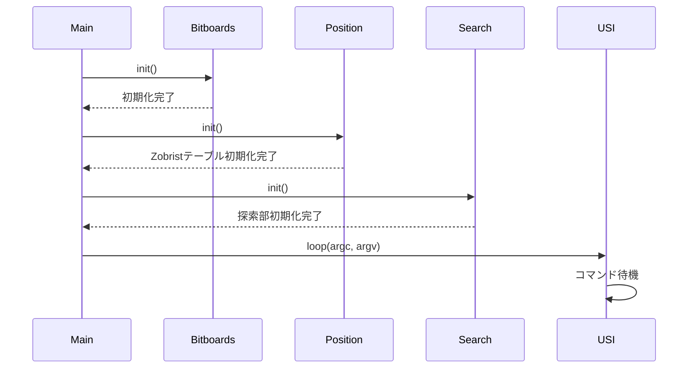
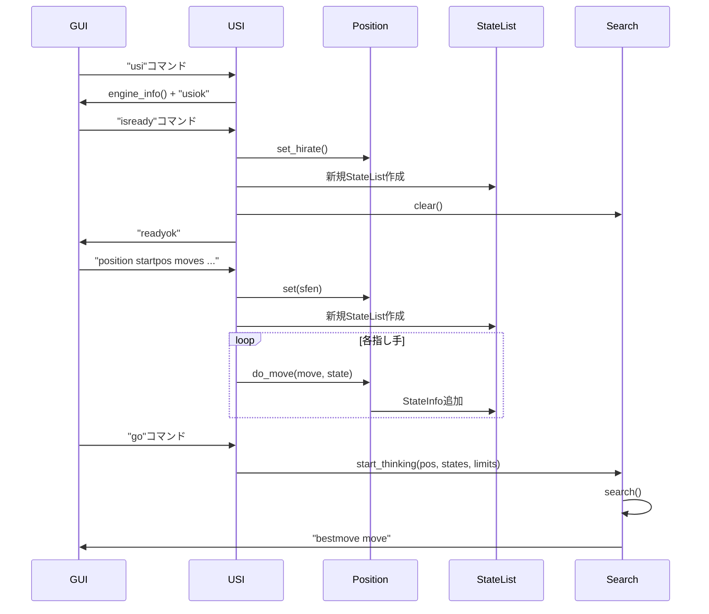
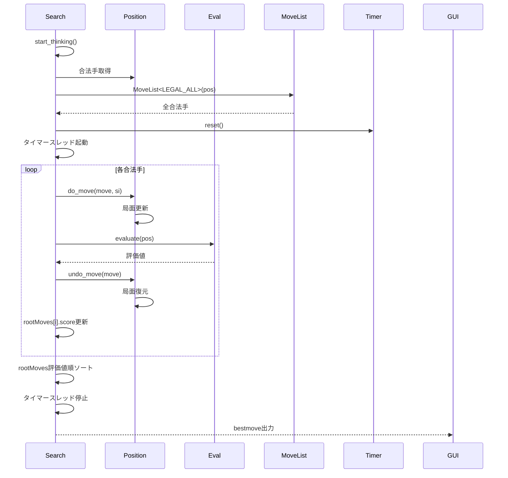
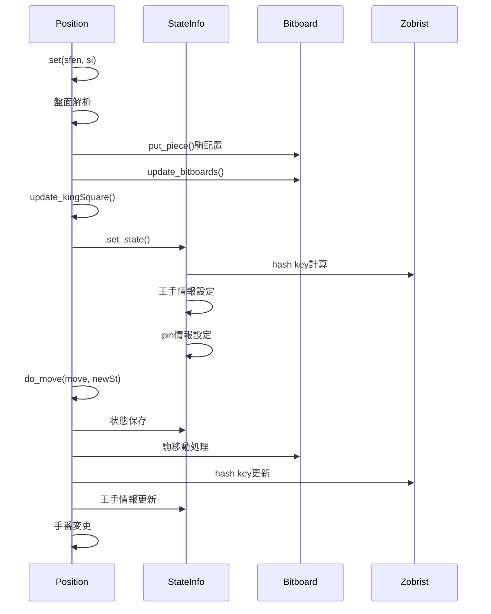
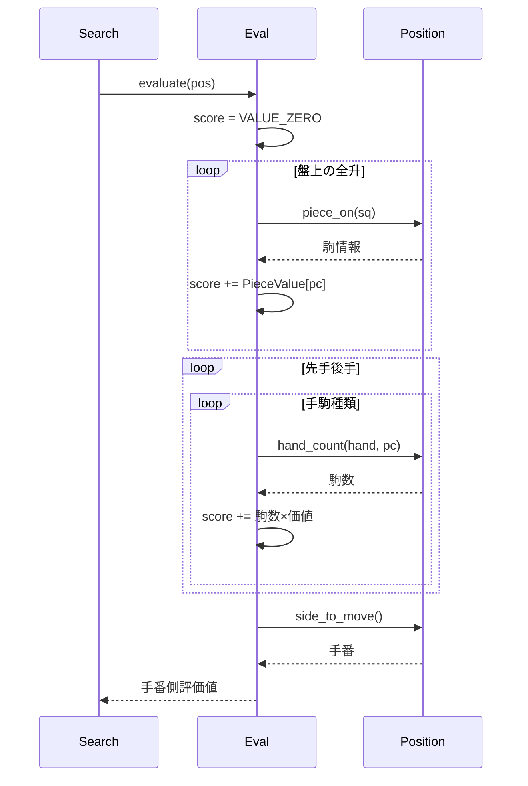
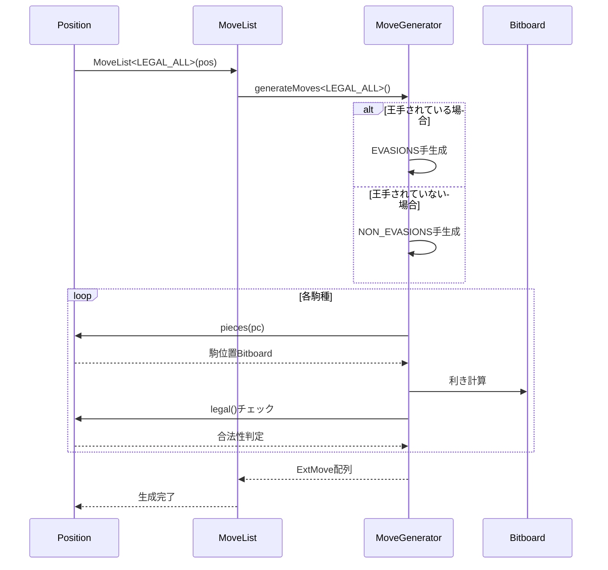
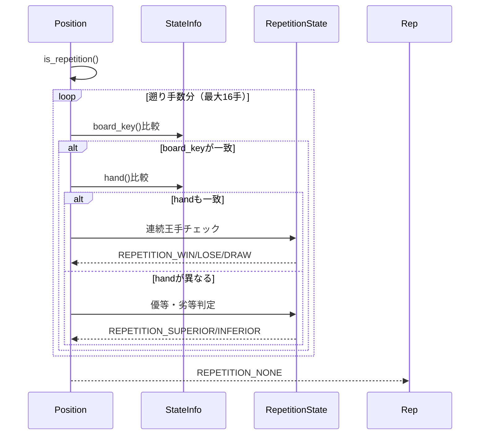

# 5五将棋思考エンジン クラスシーケンス図

やねうら王をベースとした5五将棋用思考エンジンの主要なクラス間の相互作用を示すシーケンス図です。

## 1. エンジン起動シーケンス

## 2. USIプロトコル処理シーケンス

## 3. 探索処理シーケンス

## 4. 局面管理シーケンス

## 5. 評価関数シーケンス

## 6. 指し手生成シーケンス

## 7. 千日手判定シーケンス

## 主要クラスの役割

- **Main**: エンジンのエントリーポイント、初期化処理
- **USI**: USIプロトコルのメッセージ応答、コマンド処理
- **Position**: 局面情報の管理、指し手の実行・取消
- **Search**: 探索処理の実行、時間管理、最善手の決定
- **Eval**: 局面の評価値計算
- **StateInfo**: 局面の状態情報（ハッシュキー、王手情報など）
- **Bitboard**: 盤面の駒配置管理、利き計算
- **MoveList**: 指し手の生成と管理

これらのシーケンス図は、エンジンの主要な処理フローにおけるクラス間の相互作用を示しています。